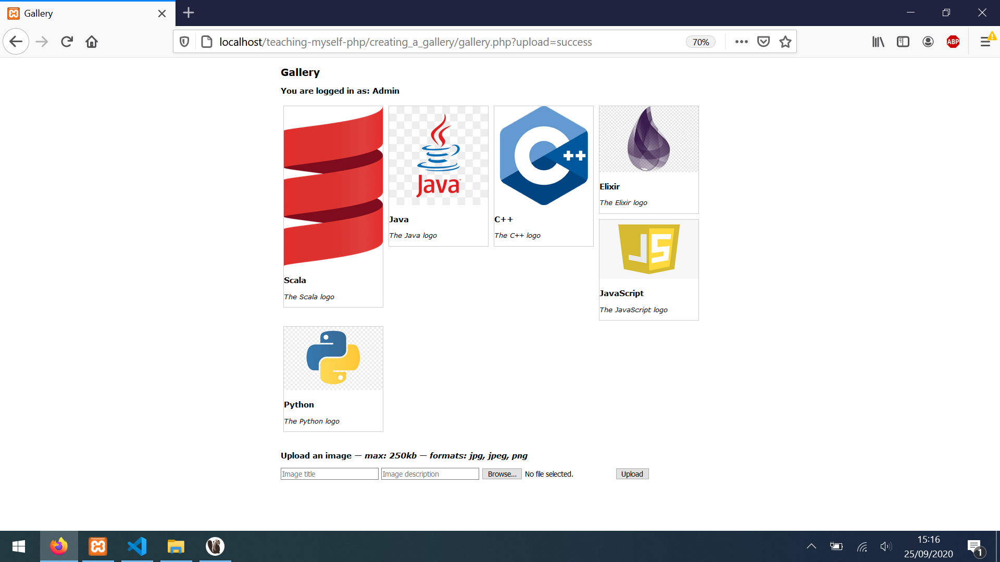

This gallery project concludes the PHP tutorial (videos 63-65).

I have refactored a lot of the SQL-related code, condensing what I need into [./includes/dbh.php](./includes/dbh.php). I've opted for a basic stylesheet and am focusing purely on the PHP.

---

I am running this on localhost with [XAMPP](https://www.apachefriends.org/download.html).

[./database.sql](./database.sql) contains the schema and some dummy data to populate the gallery.

[./test-upload/](./test-upload) contains some images to test the upload functionality.

**How the gallery looks on my machine when I add the files in `test-upload`:**

---

**Improvements**

- Learn how to unit test in PHP and create some tests for [./includes/gallery-upload.php](./includes/gallery-upload.php)
- 